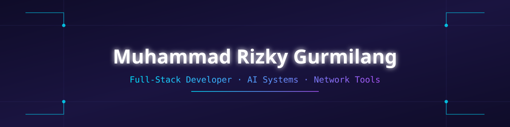

☕ Full-Stack Developer | 🤖 AI Systems | 🌐 Network Tools

[Portfolio](#) · [LinkedIn](#) · [Email](#)

 

## About Me

I'm a full-stack developer with a strong focus on building reliable, well-structured systems — from front-end interfaces to the infrastructure that supports them. I'm continuously expanding my foundation in computer networking, and I approach every project with an emphasis on clarity, maintainability, and long-term scalability.

 

## Tech Stack

 

## Networking Fundamentals

 

## GitHub Statistics

 

## My Contribution Graph

<picture>
    <source media="(prefers-color-scheme: dark)" srcset="https://raw.githubusercontent.com/GILANGGG05/GILANGGG05/output/puzzle-bobble-contribution-graph-dark.svg">
    <source media="(prefers-color-scheme: light)" srcset="https://raw.githubusercontent.com/GILANGGG05/GILANGGG05/output/puzzle-bobble-contribution-graph.svg">
    
</picture>

